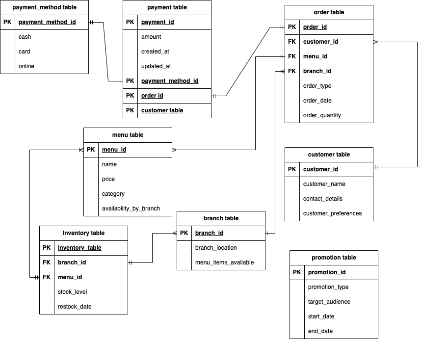

# fufu-republic-data-modeling
Fufu Republic is a popular restaurant chain in Nigeria with multiple outlets nationwide. While the core menu is standardized, some items vary by location (e.g., the Agege branch may sell Chinese Rice, while the Lekki branch might not). Customers can order online through the website or visit outlets for dine-in or take-out.

### Question 1: Map Out the Necessary Entities, Relationships, and Constraints

**Entities**:
1. **Branch**:
   - Branch ID (Primary Key)
   - Branch Location
   - Menu Items Available

2. **Customer**:
   - Customer ID (Primary Key)
   - Customer Name
   - Contact Details
   - Customer Preferences

3. **Menu Item**:
   - Menu Item ID (Primary Key)
   - Item Name
   - Price
   - Category (e.g., Beverage, Meal, Snack)
   - Availability by Branch

4. **Order**:
   - Order ID (Primary Key)
   - Order Date
   - Order Type (Dine-in, Take-out, Online)
   - Customer ID (Foreign Key)
   - Branch ID (Foreign Key)

5. **Order Details**:
   - Order ID (Foreign Key)
   - Menu Item ID (Foreign Key)
   - Quantity

6. **Payment**:
   - Payment ID (Primary Key)
   - Order ID (Foreign Key)
   - Payment Method (Cash, Debit Card, Nomba Web Checkout, Paystack, Interswitch)
   - Payment Amount

7. **Inventory**:
   - Branch ID (Foreign Key)
   - Menu Item ID (Foreign Key)
   - Stock Level
   - Restock Date

8. **Promotion**:
   - Promotion ID (Primary Key)
   - Promotion Type
   - Target Audience
   - Start Date
   - End Date

**Relationships**:
- A **Branch** has multiple **Menu Items** available.
- A **Customer** can place multiple **Orders**.
- An **Order** can have multiple **Menu Items** through **Order Details**.
- An **Order** has one **Payment**.
- Each **Branch** manages its own **Inventory** for each **Menu Item**.
- **Promotions** target specific **Customers** or groups based on purchasing behavior.

**Constraints**:
- **Menu Items** must have a price and category.
- **Orders** must have a customer, branch, and at least one menu item.
- **Inventory** levels should be updated after every order and restock.
- **Payments** must be linked to an order.

---

### Question 2: Create a Dimensional Model

**Business Process**: **Sales and Customer Purchasing Behavior**

**Business Questions**:
1. What are the most popular menu items across different branches and order types (dine-in, take-out, online)?
2. What is the revenue breakdown by branch, payment method, and order type?
3. How can personalized promotions be created based on customer purchasing behavior?

**Grain**: 
- The grain of this fact table is **one sales transaction**, representing the combination of an order, its items, payment, and customer details.

---

**Fact Table: Sales Fact**

| Column Name         | Description                                        |
|---------------------|----------------------------------------------------|
| Order ID            | Unique identifier for the order                    |
| Branch ID           | Identifier for the branch where the order was placed|
| Customer ID         | Identifier for the customer                        |
| Payment Method      | The method used for payment                        |
| Order Type          | Dine-in, Take-out, or Online                       |
| Order Date          | The date and time of the order                     |
| Total Amount        | The total revenue from the order                   |
| Menu Item ID        | The identifier for the purchased menu item         |
| Quantity            | The number of units of the menu item sold          |
| Promotion ID        | Identifier if any promotion was applied            |

---

**Dimension Tables**:

1. **Customer Dimension**:
   - Customer ID (Primary Key)
   - Customer Name
   - Contact Details
   - Customer Preferences
   - Loyalty Program Status

2. **Branch Dimension**:
   - Branch ID (Primary Key)
   - Branch Name
   - Location

3. **Menu Item Dimension**:
   - Menu Item ID (Primary Key)
   - Menu Item Name
   - Category (e.g., Meal, Beverage)
   - Price

4. **Payment Method Dimension**:
   - Payment Method (Primary Key)
   - Description (e.g., Cash, Debit Card, Paystack)

5. **Order Type Dimension**:
   - Order Type (Primary Key)
   - Description (Dine-in, Take-out, Online)

6. **Date Dimension**:
   - Date Key (Primary Key)
   - Date
   - Day
   - Week
   - Month
   - Year
   - Holiday Indicator

---

This dimensional model will allow the business to track sales trends, customer behavior, and inventory management while creating opportunities for tailored promotions.
